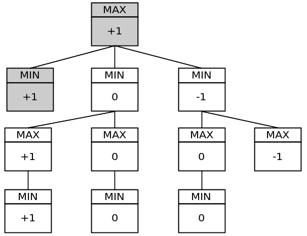

# Jogo da Velha Minimax

## Preview

	</img>

## Algoritimo
Abaixo, o melhor movimento está na posição do meio porque o valor máximo está no 2º nó à esquerda.

	</img>

Observe que a profundidade é igual aos movimentos válidos no tabuleiro.

Árvore de jogo simplificada:

	</img>

Essa árvore tem 11 nós. A árvore completa do jogo tem 549.946 nós! Você pode testá-lo colocando uma variável global estática em seu programa e incrementando-a para cada chamada de função minimax por vez, fazendo um tipo de cache.
